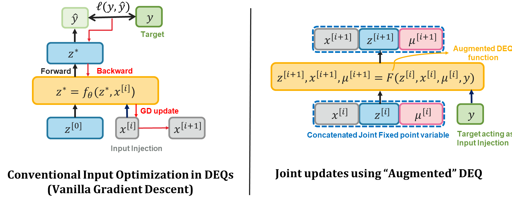

# Joint Inference and Input Optimization for Equilibrium Models

This repository contains the code for the paper [Joint Inference and Input Optimization for Equilibrium Models](https://openreview.net/pdf?id=RgH0gGH9B64) by Swaminathan Gurumurthy, Shaojie Bai, Zac Manchester and J. Zico Kolter.


Many tasks in deep learning involve optimizing over the inputs to a network to minimize or maximize some objective (example, latent space optimization in generative models). Performing such optimization, however, is traditionally quite costly, as it involves a complete forward and backward pass through the network for each gradient step. In this work, we utilize the structure of deep equilibrium models (DEQs), which compute the forward pass by finding a fixed point of a single non-linear layer, and the fact that gradient-based optimization can itself be cast as a fixed point iteration to substantially improve the overall speed. That is, we simultaneously solve for the DEQ fixed point and optimize over network inputs, all within a single "augmented" DEQ model. Indeed, the procedure is fast enough that it allows us to efficiently train DEQs for tasks traditionally relying on an "inner" optimization loop.


<p align="center"/>



### Data
- **CIFAR-10**: We download the CIFAR-10 dataset using PyTorch's torchvision package (included in this repo)
- **MNIST**: We download the CIFAR-10 dataset using PyTorch's torchvision package (included in this repo)
- **CelebA**: We download the dataset from the [official repository](https://mmlab.ie.cuhk.edu.hk/projects/CelebA.html) and extract the images in a root folder which is specified in the config file.
- **Omniglot**: We download the dataset from the [official repository](https://github.com/brendenlake/omniglot) and use the [imaml repository](https://github.com/aravindr93/imaml_dev) to define the tasks for training. The corresponding task def file location is specified in the LOAD_TASKS argument in the config file.

### Overview and Usage


The code contains the files required to train JIIO based MDEQ models for Generative modelling, inverse problems, adversarial training and meta-learning tasks.

**Generative Models and Inverse Problems**

In order to train Generative models and inverse problems, the following command needs to be run. 


```sh
python tools/jiio_vae_train.py --cfg configs/celeba_vae.yaml
```

The config files contain a number of hyperparameters and arguments which can be tweaked to get the different settings used in the paper. For example, JIIO_THRES controls the number of inner loop JIIO iterations, TRAIN_VAE controls if one wants to train a VAE v/s a JIIO based generative model. INV_PROB controls which inverse problem we want to solve : options include 'reconstruction', 'inpainting', 'denoising02', 'denoising04' etc.

Further, once trained various aspects of the model can be tested using the following command.


```sh
python tools/jiio_vae_test.py --cfg configs/celeba_vae.yaml --task psnr --testModel /path/to/model/
```

The --task argument specifies the aspect of the model to test. The other options include 'timing', 'get_samples_for_fid', etc. For obtaining the FID results, the code saves the generations and the test set in a folder. The user would have to use the online repos for computing the FID "https://github.com/bioinf-jku/TTUR" or "https://github.com/mseitzer/pytorch-fid".


**Adversarial Training**

For the adversarial training experiments, one can run the following command. 

```sh
python tools/cls_train.py --cfg configs/YAML_FILE
```

The 'YAML_FILE' argument above specifies the config file for the specific dataset. eg. mnist_cls.yaml or cifar_cls.yaml. These yaml files again have a bunch of hyperparameters and arguments that can be set to test different aspects of the model. For example, PROJ_GD can be toggled to switch between JIIO based adversarial training and PGD adversarial training. EPSILON decides the norm ball radius for the attacks etc. 

Likewise, for testing the trained models with specific adversarial attacks one could modify the yaml files and run the following command

```sh
python tools/cls_test.py --cfg configs/YAML_FILE --testModel /path/to/model
```


**Gradient based Meta-Learning**

Finally, for the meta-learning experiments, specify the location of the task definitions (generating using the [imaml repository](https://github.com/aravindr93/imaml_dev)) in the corresponding omniglot.yaml file, add the repository to $PYTHONPATH and then run:
```sh
python tools/jiio_imaml_train.py --cfg configs/omniglot_imaml.yaml
```
Some of the meta-learning specific variables in the config file include N_WAY, K_SHOT, NUM_TASKS, NUM_TEST_TASKS which correspond to what their names imply. 

Likewise for testing the model, the following command can be run:
```sh
python tools/jiio_imaml_test.py --cfg configs/omniglot_imaml.yaml --testModel /path/to/model
```

### Important hyperparameters

- `MEM` - specifies the memory size used for anderson/broyden during the optimization
- `PROJ_GD` - performs projected GD or projected Adam when set to true instead of JIIO
- `TRAJ_REG` - whether to provide jacobian regularization at randomly sampled points in the trajectory vs converged point
- `JIIO_THRES` - Number of iterations for JIIO optimization
- `ALPHA_0` - The learning rates for the gradient step in JIIO, i.e the lr for x. The lr for z and mu are fixed
- `JAC_COEFF` - weight for jacobian regularization in the loss

### Prerequisites

Python >= 3.6 and PyTorch >= 1.4.0
We also provide a conda environment config file 'environment.yml' and 'requirements.txt' which can be used to setup the conda environment to run the above experiments.
4 GPUs are strongly recommended for the experiments involving generative modelling/inverse problems/meta-learning. For the adversarial training experiments 2 GPUs are sufficient.

### Important files:
lib/models/mdeq_core.py consists of the classes for robust classifier, mdeqjiio etc which construct the respective architectures and call the required optimizers.

lib/models/mdeq_forward_backward.py consists of the optimizer wrappers which define the costs, tasks etc for the JIIO optimizers and calls the forward and backward pass of the optimizer.

lib/modules/deq2d.py defines the actual forward and backward passes through the JIIO optimizer.

lib/modules/broyden.py defines the broyden and anderson acceleration methods used for finding the fixed points.

### Acknowledgements

Much of the code for the underlying MDEQ models is borrowed from the [DEQ Repo](https://github.com/locuslab/deq)

### Bibtex

```
@inproceedings{gurumurthy2021joint,
  title     = {Joint inference and input optimization in equilibrium networks},
  author    = {Swaminathan Gurumurthy and Shaojie Bai and Zachary Manchester and J Zico Kolter},
  booktitle = {Thirty-Fifth Conference on Neural Information Processing Systems},
  year      = {2021},
  url={https://openreview.net/forum?id=RgH0gGH9B64}
}
```